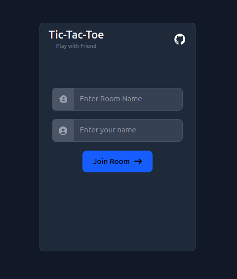

<div style="display: flex; justify-content: space-between;">
  
  
</div>

### Features

#### Multiplayer Support

- Play real-time Tic-Tac-Toe with another player in a shared game room.
- Players are assigned X or O automatically when they join.

#### Room-Based Gameplay

- Create or join a unique game room using a Room ID.
- When a player leaves, their name is removed from the room.
- If both players leave, the room is deleted automatically.

#### Real-Time Updates

- **Instant Move Syncing:** Each move updates the board in real-time for both players.
- **Turn-Based System:** Displays whose turn it is dynamically.
- **Game Restart:** Restart the match without leaving the room.

#### Game Result Handling

- **Winner Display:** Shows the winner’s name when the game ends.
- **Draw Handling:** Displays "It's a Tie!" when there’s no winner.


### Run the App locally

```bash
#go to the 03.tic-tac-toe
cd 03.tic-tac-toe

#install dependency
yarn install

#run the app
yarn run dev

```
