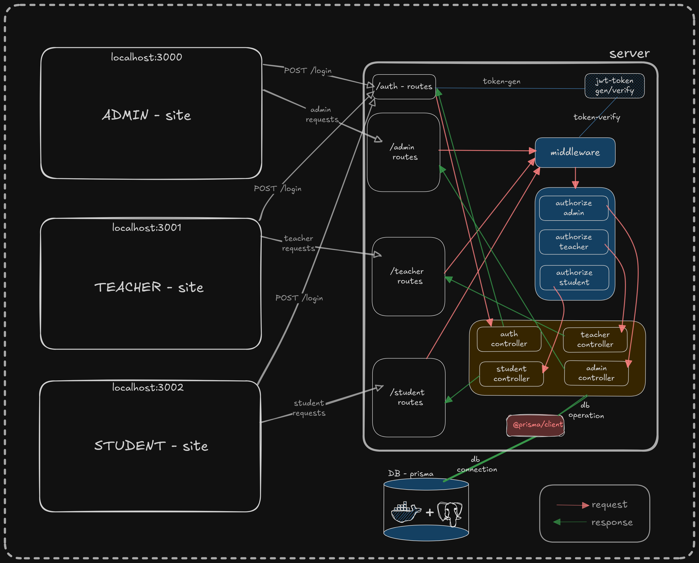
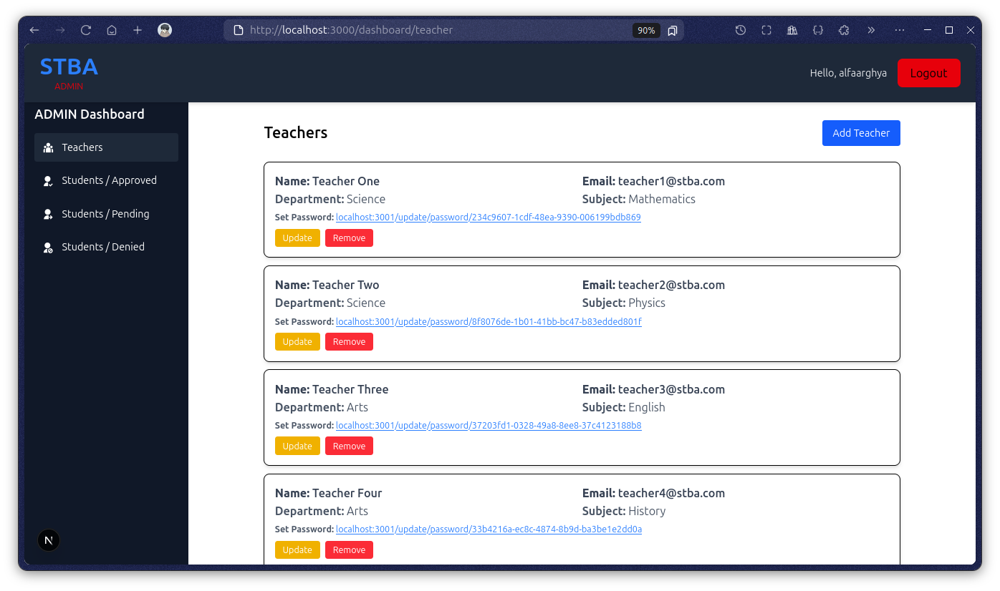
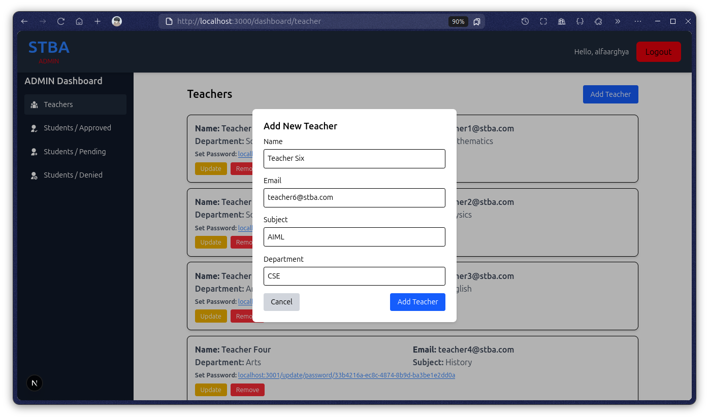
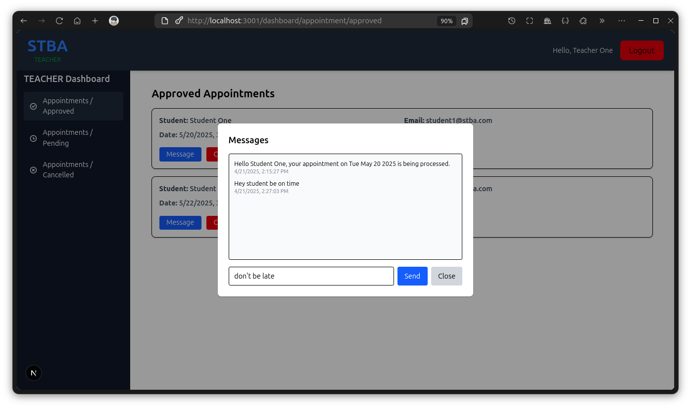
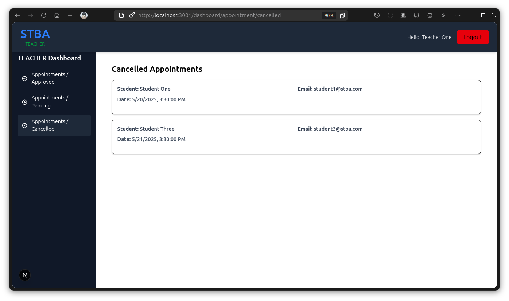
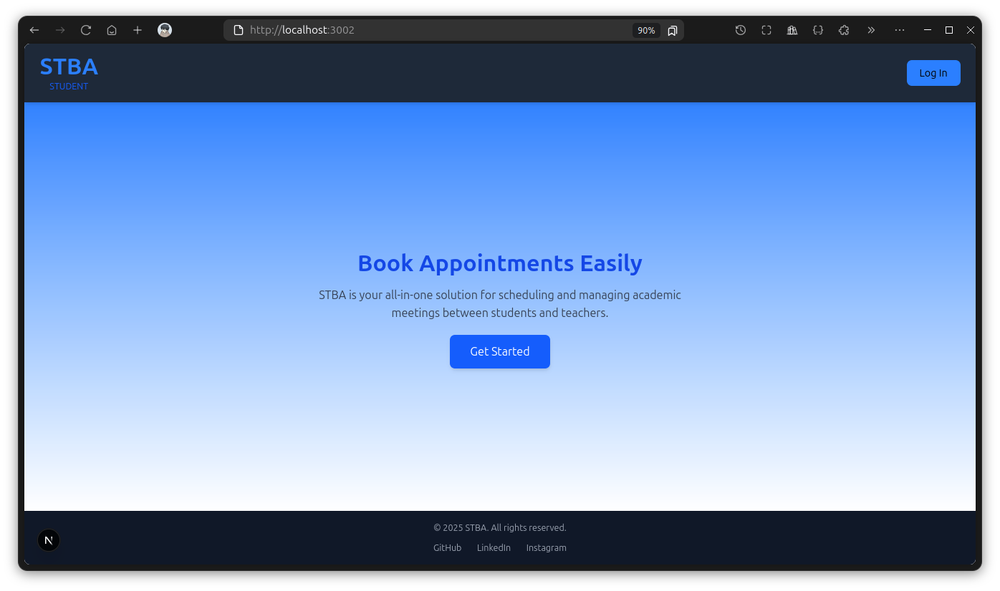
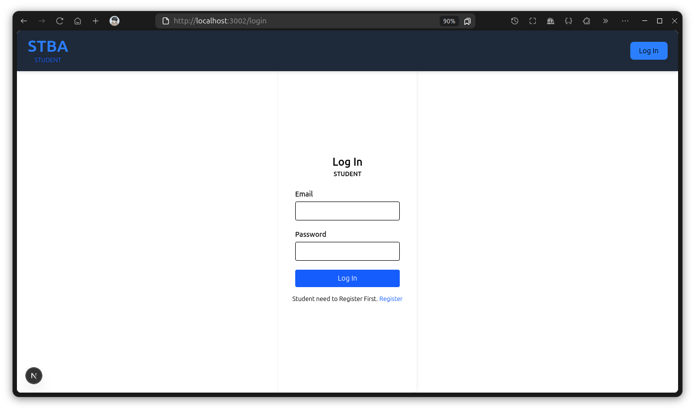
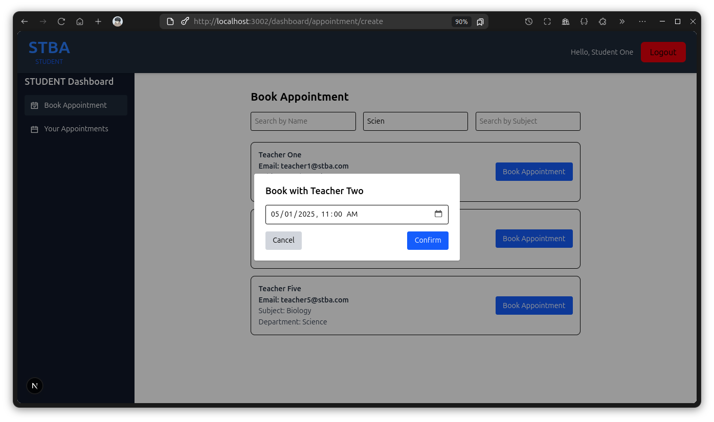
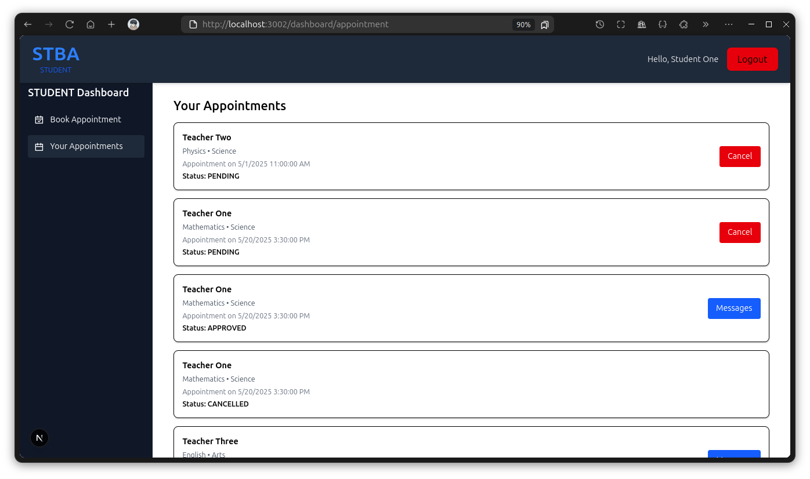

### Features

#### Authentication & Role-Based Access

- Secure login system for three user roles: Admin, Teacher, and Student.

- Role-based dashboard navigation with protected routes using middleware and token validation.

- Teachers must set their password to activate their account.

- Student need to register first & wait for admin approval

#### Admin Functionalities

- Add / Update / REMOVE Teachers.

- Set or update teacher credentials(email), subject, department details.

- Manage student registrations: View and update student approval statuses (PENDING, APPROVED, DENIED).

#### Teacher Dashboard

- View appointments by status: PENDING, APPROVED, CANCELLED.

- Approve or cancel appointment requests from students.

- Once approved, send messages to students related to the appointment.

- View all previous messages for an appointment (messaging is one-way from teacher to student).

#### Student Dashboard

- Book Appointments with teachers using dynamic search filters (by name, subject, department).

- instant appointment booking using modal with date-time picker.

- View All Appointments: Includes cancel button for non-cancelled appointments.

- View messages from teachers for approved appointments.

### Run the App locally

#### 1. Go to the `05.student-teacher-booking-appointment` & install all dependency

```bash
#go to the project
cd 05.student-teacher-booking-appointment

#install dependency
yarn install
```

#### 2. Create .env files

```bash
#db's env
cd packages/db/
cp .env.example .env
cd ../..

#server's env
cd apps/server/
cp .env.example .env
cd ../..
```

#### 3. connect the db

```bash
#starting the postgres db with docker
docker run --name stbaDB -e POSTGRES_PASSWORD=stbaadminpassword -p 5432:5432 -d postgres

#migrate db
yarn run db:migrate

#generate client
yarn run db:generate

#optional - show the actual db
yarn run db:show
```

#### 4. run all applications

```bash
yarn run dev
```

#### 5. visit all sites

1. Go to admin site -> [localhost:3000](localhost:3000)

2. Go to teacher site -> [localhost:3001](localhost:3001)

3. Go to teacher site -> [localhost:3002](localhost:3002)

#### 6. some predefined credentials for login & testing

```bash
#admin 1
email: admin1@stba.com
password: admin123

#admin 2
email: alfaarghya.admin@stba.com
password: admin456
```

```bash
#---- already password set ----#
#teacher 1
email: teacher1@stba.com
password: teach123

#teacher 2
email: teacher2@stba.com
password: teach456

#teacher 3
email: teacher3@stba.com
password: teach789


#---- password is not set yet ----#
#teacher 4
email: teacher4@stba.com

#teacher 5
email: teacher5@stba.com
```

```bash
#---- registration APPROVED ----#
#student 1
email: student1@stba.com
password: student123

#student 2
email: student2@stba.com
password: student456

#student 3
email: student3@stba.com
password: student789

#student 4
email: student4@stba.com
password: student000

#student 5
email: student5@stba.com
password: student321


#---- registration PENDING ----#
#student 6
email: student6@stba.com
password: student654

#student 7
email: student7@stba.com
password: student987

#student 8
email: student8@stba.com
password: student111


#---- registration DENIED ----#
#student 9
email: student9@stba.com
password: student222

#student 10
email: student10@stba.com
password: student333
```

### Demos

#### 1. ADMIN site






#### 2. TEACHER site






#### 3. STUDENT site








