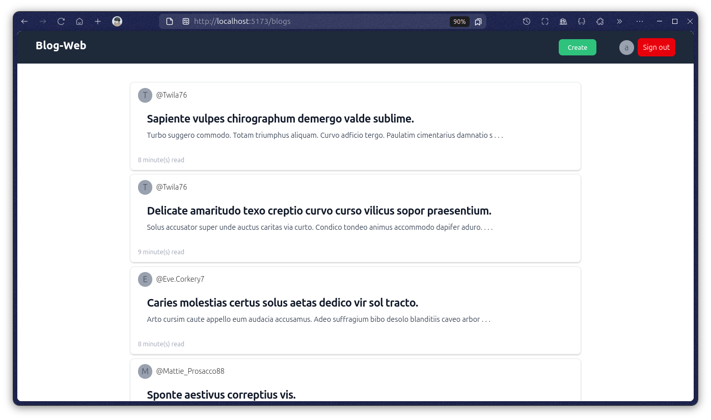
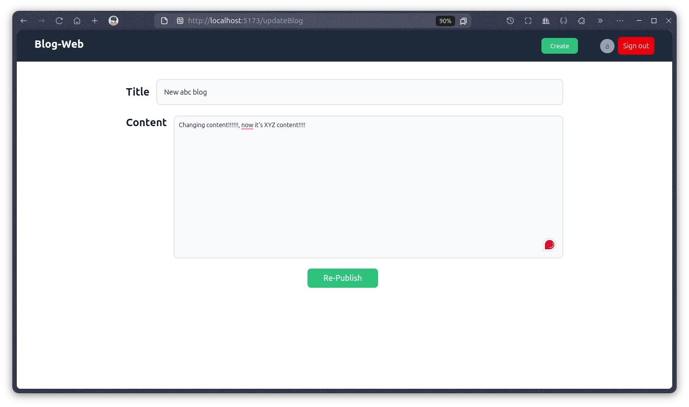
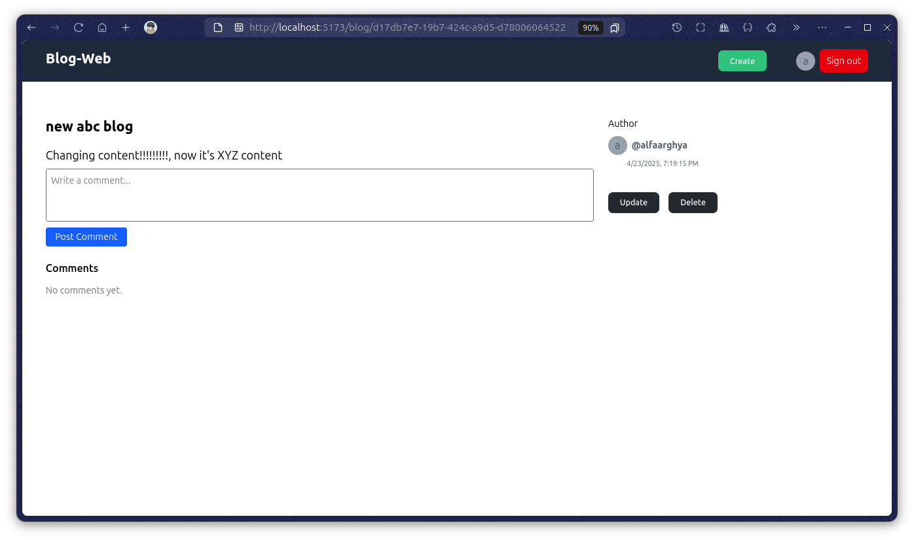
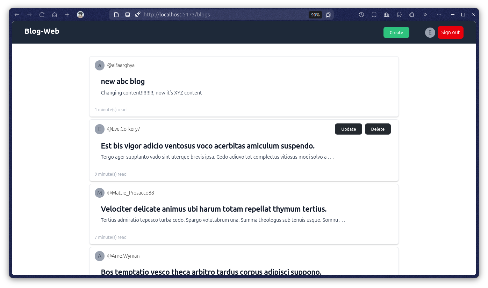

### Features

#### Authentication

- secure user signin/signup with api routes
- successful signin/signup generate `auth token` that will be store on cookies
- all routes are protected, only register user can access blog & comment routes .
- when user logout all cookies will removed

#### Blogs

- User can post or update or delete their blogs.
- User can read the full blog by clicking on blog.
- Each blogs have their date of publication.

#### comments

- User can post their comments on each blog
- each comment will have the name of the people

### Run the App locally

#### 1. Go to the `06.blog-web` & install all dependency

```bash
#go to the project
cd 06.blog-web

#install dependency
yarn install
```

#### 2. Create .env files

```bash
#db's env
cd packages/db/
cp .env.example .env
cd ../..

#server's env
cd apps/server/
cp .env.example .env
cd ../..
```

#### 3. connect the db

```bash
#starting the postgres db with docker
docker run --name blogDB -e POSTGRES_PASSWORD=blogwebadminpassword -p 5432:5432 -d postgres

#migrate db
yarn run db:migrate

#generate client
yarn run db:generate

#optional - show the actual db
yarn run db:show
```

#### 4. run all applications

```bash
yarn run dev
```

Now visit `localhost:5173/`

#### 5. some predefined credentials for login & testing

```bash
# username & email will be generated by faker-js
# to get usernames first have to look into db
yarn run db:show #now go to localhost:5555

#---------
password: password12345 #password is same for each and every users
```

### Demos

#### 1. Sign up


#### 2. Blogs



#### 3. Create blog


#### 4. Update blog




#### 5. Read Blog & comments




#### 6. Sign in(with predefined credentials)



