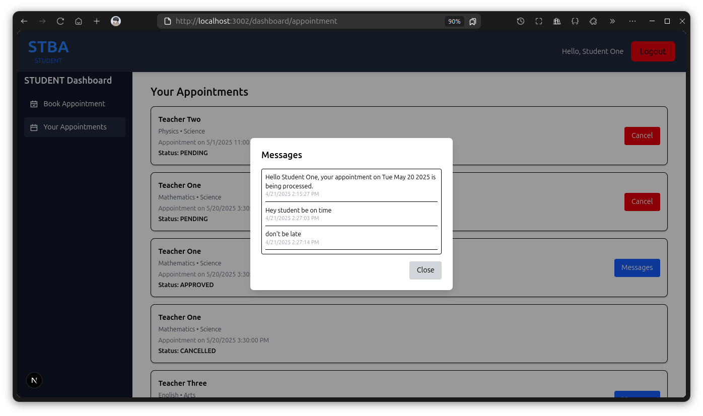
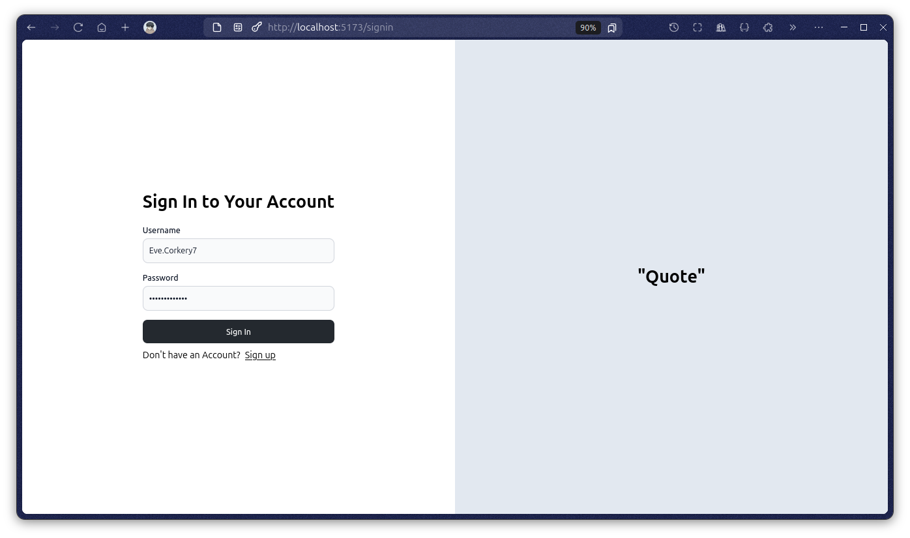

# Clone the repo

```bash
git clone https://github.com/alfaarghya/UMIP26951.git

# or

git clone git@github.com:alfaarghya/UMIP26951.git

```

# 01.WeatherApp


### Features

- Search Bar
- weather, Temperature, Humidity, Wind Speed
- Sunrise & Sunset time

### How to run app locally

1. install the dependency

```bash
#go to the 01.WeatherApp
cd 01.WeatherApp

#install dependency
yarn install

```

2. copy `.env.example` as `.env` and fill up the data

```bash
#openweathermap API key
VITE_API_KEY=
```

3. Now run the app

```bash
yarn run dev
```

# 02.Calculator


### Features

- Perform basic operations(addition, subtraction, multiplication, and division.)
- Calculate with BODMAS rule.
- Perform advance operations(square root, percentage, Exponentiation (xʸ), Common Logarithm (log), and Exponential Function (eˣ)).
- Store history on local storage.
- toggle between light & dark mode.

### Run the App locally

```bash
#go to the 02.Calculator
cd 02.Calculator

#install dependency
yarn install

#run the app
yarn run dev

```

# 03.Tic-Tac-Toe

<div style="display: flex; justify-content: space-between;">
  
  
</div>

### Features

#### Multiplayer Support

- Play real-time Tic-Tac-Toe with another player in a shared game room.
- Players are assigned X or O automatically when they join.

#### Room-Based Gameplay

- Create or join a unique game room using a Room ID.
- When a player leaves, their name is removed from the room.
- If both players leave, the room is deleted automatically.

#### Real-Time Updates

- **Instant Move Syncing:** Each move updates the board in real-time for both players.
- **Turn-Based System:** Displays whose turn it is dynamically.
- **Game Restart:** Restart the match without leaving the room.

#### Game Result Handling

- **Winner Display:** Shows the winner’s name when the game ends.
- **Draw Handling:** Displays "It's a Tie!" when there’s no winner.


### Run the App locally

```bash
#go to the 03.tic-tac-toe
cd 03.tic-tac-toe

#install dependency
yarn install

#run the app
yarn run dev

```

# 04.chat-app


### Features

#### Authentication

- secure user signin/signup with api routes
- successful signin/signup generate `auth token` that will be store on cookies
- all routes are protected, only register user can access chat, create room, join room etc.
- when user logout all cookies will by default

#### Real-time Chat System

- Send and receive messages instantly using WebSocket
- Messages are updated live without needing to refresh

#### Chat Room Functionality

- Users can create public chat rooms with unique names
- Users can join existing rooms by entering the room name
- Messages are visible to everyone in the room
- Each message shows sender name, timestamp, and message content
- when any user is not present in room, message will store on db

#### Direct Messaging (DM)

- Debounced search bar for username search, Users can search for other users by username
- Initiate private one-on-one chats
- DM conversations are private between two users

#### Message Formatting

- Support for bold (**text**), italic (_text_) and code(`text`) styles using markdown-like syntax

### Run the App locally

#### 1. Go to the `04.chat-app` & install all dependency

```bash
#go to the 04.chat-app
cd 04.chat-app

#install dependency
yarn install

```

#### 2. Create .env files

```bash
#db's env
cd packages/db/
cp .env.example .env
cd ../..

#server's env
cd apps/server/
cp .env.example .env
cd ../..
```

#### 3. connect the db

```bash
#starting the postgres db with docker
docker run --name chatDB -e POSTGRES_PASSWORD=chatappadminpassword -p 5432:5432 -d postgres

#migrate db
yarn run db:migrate

#generate client
yarn run db:generate

#optional - show the actual db
yarn run db:show
```

#### 4. run all applications

```bash
yarn run dev
```

Now visit the website `localhost:3000`

#### **optional** - some predefined credentials for login & testing

```bash
#user 1
username: alice
password: password123

#user 2
username: bob
password: password456

#user 3
username: charlie
password: password789
```

### Demos

#### 1. Landing page


#### 2. Sign up page


#### 3. Sign in page


#### 4. Chat page


#### 5. create room page


#### 6. join room page


#### 7. room chat page


#### 8. Search by username


#### 9. inbox chat


# 05.student-teacher-booking-appointment


### Features

#### Authentication & Role-Based Access

- Secure login system for three user roles: Admin, Teacher, and Student.

- Role-based dashboard navigation with protected routes using middleware and token validation.

- Teachers must set their password to activate their account.

- Student need to register first & wait for admin approval

#### Admin Functionalities

- Add / Update / REMOVE Teachers.

- Set or update teacher credentials(email), subject, department details.

- Manage student registrations: View and update student approval statuses (PENDING, APPROVED, DENIED).

#### Teacher Dashboard

- View appointments by status: PENDING, APPROVED, CANCELLED.

- Approve or cancel appointment requests from students.

- Once approved, send messages to students related to the appointment.

- View all previous messages for an appointment (messaging is one-way from teacher to student).

#### Student Dashboard

- Book Appointments with teachers using dynamic search filters (by name, subject, department).

- instant appointment booking using modal with date-time picker.

- View All Appointments: Includes cancel button for non-cancelled appointments.

- View messages from teachers for approved appointments.

### Run the App locally

#### 1. Go to the `05.student-teacher-booking-appointment` & install all dependency

```bash
#go to the project
cd 05.student-teacher-booking-appointment

#install dependency
yarn install
```

#### 2. Create .env files

```bash
#db's env
cd packages/db/
cp .env.example .env
cd ../..

#server's env
cd apps/server/
cp .env.example .env
cd ../..
```

#### 3. connect the db

```bash
#starting the postgres db with docker
docker run --name stbaDB -e POSTGRES_PASSWORD=stbaadminpassword -p 5432:5432 -d postgres

#migrate db
yarn run db:migrate

#generate client
yarn run db:generate

#optional - show the actual db
yarn run db:show
```

#### 4. run all applications

```bash
yarn run dev
```

#### 5. visit all sites

1. Go to admin site -> [localhost:3000](localhost:3000)

2. Go to teacher site -> [localhost:3001](localhost:3001)

3. Go to teacher site -> [localhost:3002](localhost:3002)

#### 6. some predefined credentials for login & testing

```bash
#admin 1
email: admin1@stba.com
password: admin123

#admin 2
email: alfaarghya.admin@stba.com
password: admin456
```

```bash
#---- already password set ----#
#teacher 1
email: teacher1@stba.com
password: teach123

#teacher 2
email: teacher2@stba.com
password: teach456

#teacher 3
email: teacher3@stba.com
password: teach789


#---- password is not set yet ----#
#teacher 4
email: teacher4@stba.com

#teacher 5
email: teacher5@stba.com
```

```bash
#---- registration APPROVED ----#
#student 1
email: student1@stba.com
password: student123

#student 2
email: student2@stba.com
password: student456

#student 3
email: student3@stba.com
password: student789

#student 4
email: student4@stba.com
password: student000

#student 5
email: student5@stba.com
password: student321


#---- registration PENDING ----#
#student 6
email: student6@stba.com
password: student654

#student 7
email: student7@stba.com
password: student987

#student 8
email: student8@stba.com
password: student111


#---- registration DENIED ----#
#student 9
email: student9@stba.com
password: student222

#student 10
email: student10@stba.com
password: student333
```

### Demos

#### 1. ADMIN site


#### 2. TEACHER site


#### 3. STUDENT site




# 06.blog-web

### Features

#### Authentication

- secure user signin/signup with api routes
- successful signin/signup generate `auth token` that will be store on cookies
- all routes are protected, only register user can access blog & comment routes .
- when user logout all cookies will removed

#### Blogs

- User can post or update or delete their blogs.
- User can read the full blog by clicking on blog.
- Each blogs have their date of publication.

#### comments

- User can post their comments on each blog
- each comment will have the name of the people

### Run the App locally

#### 1. Go to the `06.blog-web` & install all dependency

```bash
#go to the project
cd 06.blog-web

#install dependency
yarn install
```

#### 2. Create .env files

```bash
#db's env
cd packages/db/
cp .env.example .env
cd ../..

#server's env
cd apps/server/
cp .env.example .env
cd ../..
```

#### 3. connect the db

```bash
#starting the postgres db with docker
docker run --name blogDB -e POSTGRES_PASSWORD=blogwebadminpassword -p 5432:5432 -d postgres

#migrate db
yarn run db:migrate

#generate client
yarn run db:generate

#optional - show the actual db
yarn run db:show
```

#### 4. run all applications

```bash
yarn run dev
```

Now visit `localhost:5173/`

#### 5. some predefined credentials for login & testing

```bash
# username & email will be generated by faker-js
# to get usernames first have to look into db
yarn run db:show #now go to localhost:5555

#---------
password: password12345 #password is same for each and every users
```

### Demos

#### 1. Sign up


#### 2. Blogs


#### 3. Create blog


#### 4. Update blog


#### 5. Read Blog & comments


#### 6. Sign in(with predefined credentials)




# 07.portfolio(additional project)

it's a additional project, So I designed it according to my style to showcase my frontend skills along side with my backend skills

### visit the site

[https://alfaarghyadev.vercel.app/](`https://alfaarghyadev.vercel.app/`)

### Run the App locally

```bash
#go to the project
cd 07.portfolio

#install dependency
yarn install

#run the project
yarn run dev
```

### Demos


